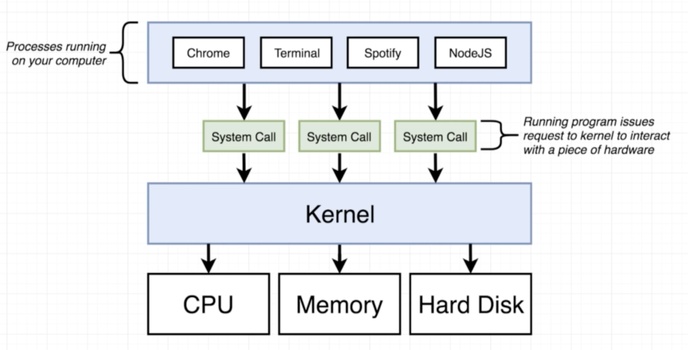

# Container 基礎

### 作業系統運作方式

Docker是用來管理Container的工具，真正內容或檔案的運行仍舊是透過container來執行，要了解container之前，要先提到作業系統運作的模式：

在電腦中，每一個應用程式都會透過系統呼叫 \(system call\) 來和作業系統的核心 \(kernel\)，再交由核心去調用需要使用的資源，如上圖中的CPU、Memory、硬碟空間等。

### 切割命名空間

在Docker和container的概念出現之前，為了解決應用程式上環境需求的衝突，我們會使用命名空間的方式，在硬碟中切割出不同空間以存放不同的需求程式，如下圖所示。

