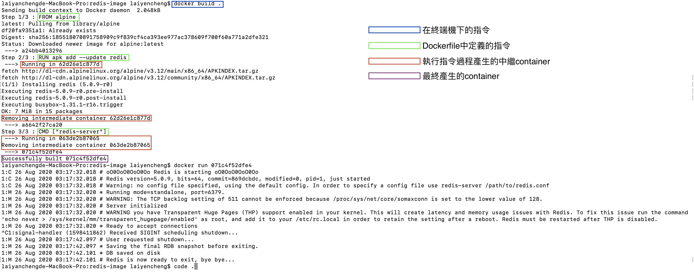
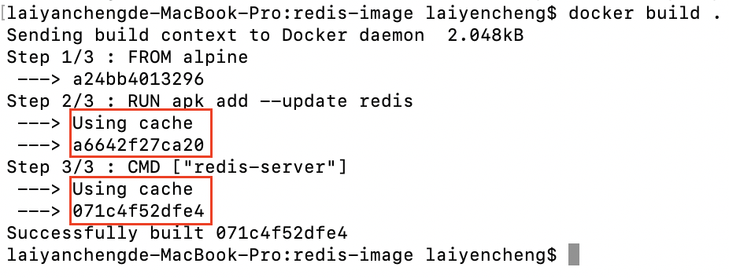
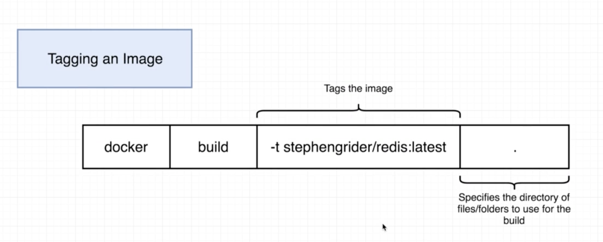
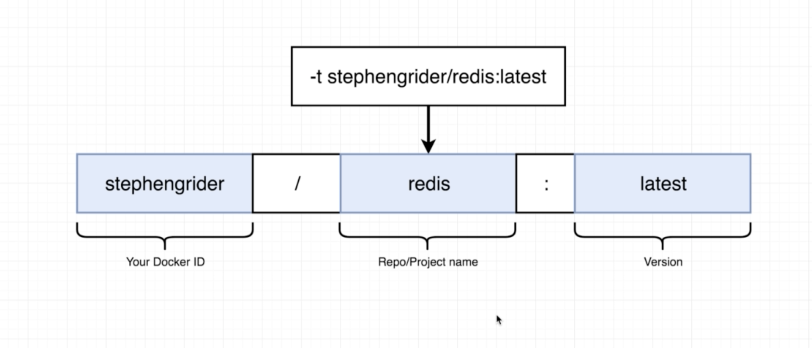
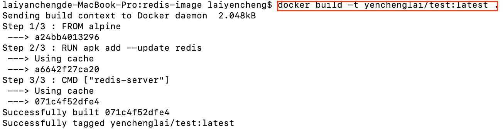
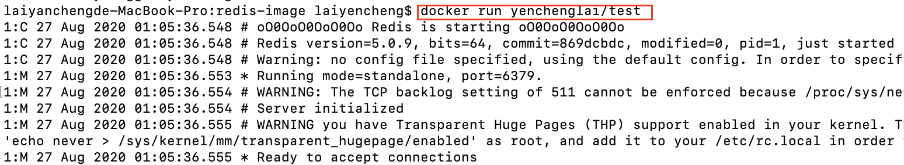

# 建立自己的Docker Image

### Docker Image的產生流程

除了使用Docker Hub提供的image檔以外，開發人員當然也能建立自己的docker image，運行的方式大致如下圖：


步驟主要如下：

1. 建立一個 Dockerfile。
2. 透過Docker CLI下達指令。
3. 交由Docker Server進行包裝。
4. 得到Docker Image檔案。

### 建立Dockerfile

要建立一個Docker Image，我們首先要建立一個Dockerfile，下圖是一個Dockerfile的案例：\(路徑沒有限制，Dockerfile本身沒有副檔名\)


在Dockerfile所在的同一層路徑位置執行指令：

```text
docker build .
```

上述指令就會依照DockerFile中的定義去建立Docker Image，圖中指令說明

* FROM：根據哪一個docker image去建立base image作為基礎，一定要是第一個指令。
* RUN：在base image的檔案系統中使用shell執行命令。
* CMD：指定container啟動時要執行的指令，只能有一條CMD指令，重複僅執行最後一次。
* 其餘指令可參考：[https://philipzheng.gitbook.io/docker\_practice/dockerfile/instructions](https://philipzheng.gitbook.io/docker_practice/dockerfile/instructions)

### 注意事項

* 不論是RUN或者是CMD，每一條指令都會在Docker Image Cache中產生執行過程的中繼container，如下圖。



* 一旦已經在Image Cache中產生過container，只要**執行順序不變** \(因為不同的執行順序會產生不同內容的File System Snapshot\)，docker就會從Image Cache中取得既有的container進行操作，藉以提升效能與節約時間，如下圖。



### 建立別名

許多知名開發工具都有自己的docker image，例如Redis、Node.js等等，我們也因此可以用簡單的指令啟動container，例如：

```text
docker run hello-world
```

在建立自己的Docker Image時，我們也可以透過指令給予別名，指令圖解如下：



細部分解中間的tag部分：



別名的最前段為使用者的Docker ID，以 / 隔開後接自訂名稱\(建議以專案或Repository名稱為主\)，最後：後接版本號。測試如下圖：



啟動該Docker Image時，除非要指定先前的版本，否則預設會拿到最新的版本：



