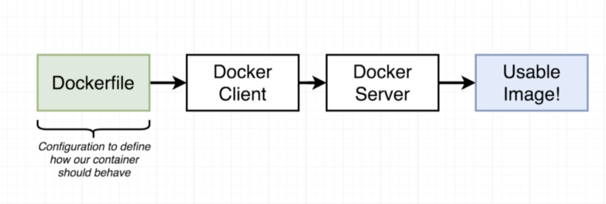
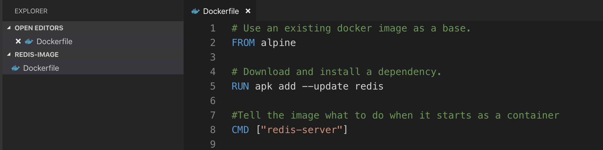

# 建立自己的Docker Image

### Docker Image的產生流程

除了使用Docker Hub提供的image檔以外，開發人員當然也能建立自己的docker image，運行的方式大致如下圖：



步驟主要如下：

1. 建立一個 Dockerfile。
2. 透過Docker CLI下達指令。
3. 交由Docker Server進行包裝。
4. 得到Docker Image檔案。

### 建立Dockerfile

要建立一個Docker Image，我們首先要建立一個Dockerfile，下圖是一個Dockerfile的案例：\(路徑沒有限制，Dockerfile本身沒有副檔名\)



在Dockerfile所在的同一層路徑位置執行指令：

```text
docker build .
```

上述指令就會依照DockerFile中的定義去建立Docker Image，圖中指令說明

* FROM：根據哪一個docker image去建立base image作為基礎，一定要是第一個指令。
* RUN：在base image的檔案系統中使用shell執行命令。
* CMD：指定container啟動時要執行的指令，只能有一條CMD指令，重複僅執行最後一次。
* 其餘指令可參考：[https://philipzheng.gitbook.io/docker\_practice/dockerfile/instructions](https://philipzheng.gitbook.io/docker_practice/dockerfile/instructions)


