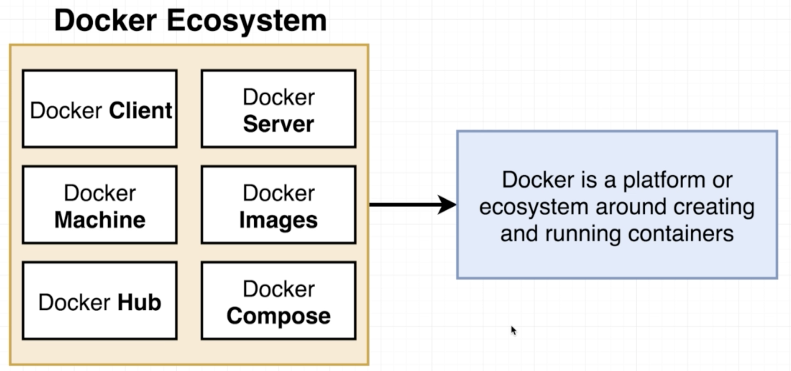
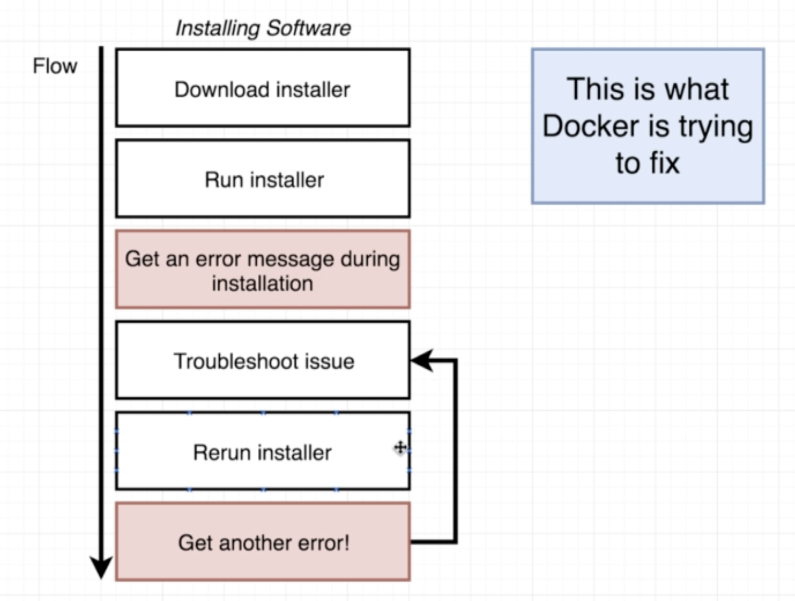
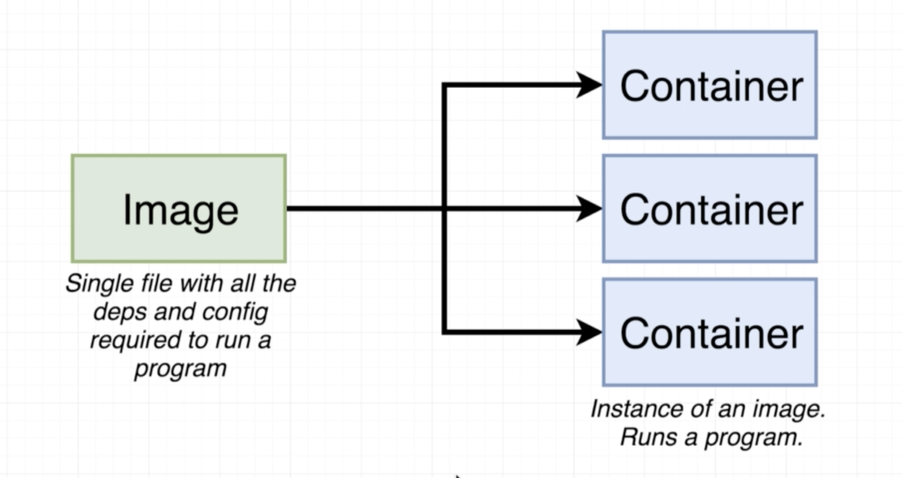
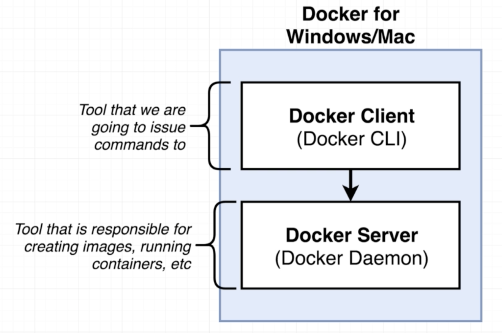
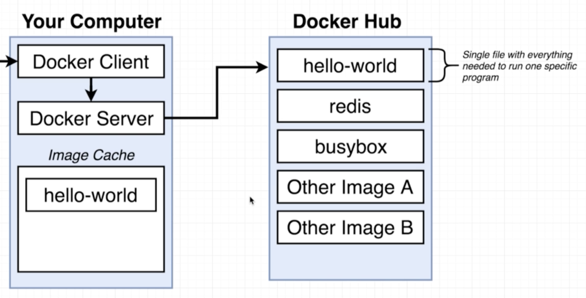

# Docker 基礎

### 什麼是Docker

Docker是一個可以運行container\(容器\)的平台、生態環境。

### 為什麼要用Docker

Docker是為了要解決我們遭遇到的環境問題，在Docker出現以前，當我們在做環境移植時常會出現下圖的窘境。

使用Docker這項工具可以簡化開發人員的困擾，當需要安裝或移植環境時，可以不必擔心基礎設定或者環境相依性，只要透過Docker image檔案，就可以產生對應的容器\(container\)。

### Docker CLI 和Docker Server

開發人員在終端是透過Docker Client \(CLI\) 操作，而真正執行Docker的核心運作\(建立Docker Image、創造container等等\)的是Docker Server。

使用Docker需要註冊一個帳號，並透過他對Docker Hub \([https://hub.docker.com/](https://hub.docker.com/)\) 做存取。當Docker CLI下指令建立Docker Image時，Docker Server會先在Image Cache中尋找Image檔，如果沒有相對應的檔案時，Docker Server就會和遠端的Docker Hub要求檔案，在下載到自己的Image Cache中。

