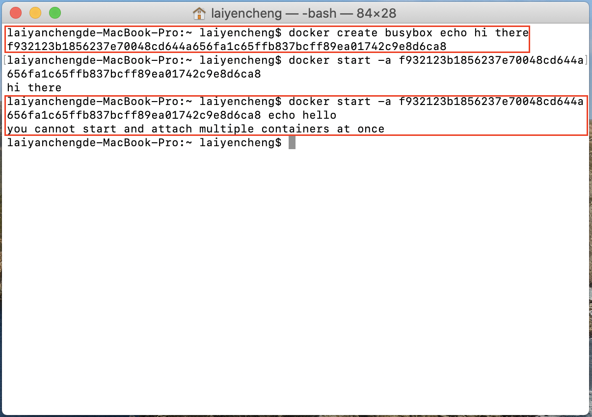
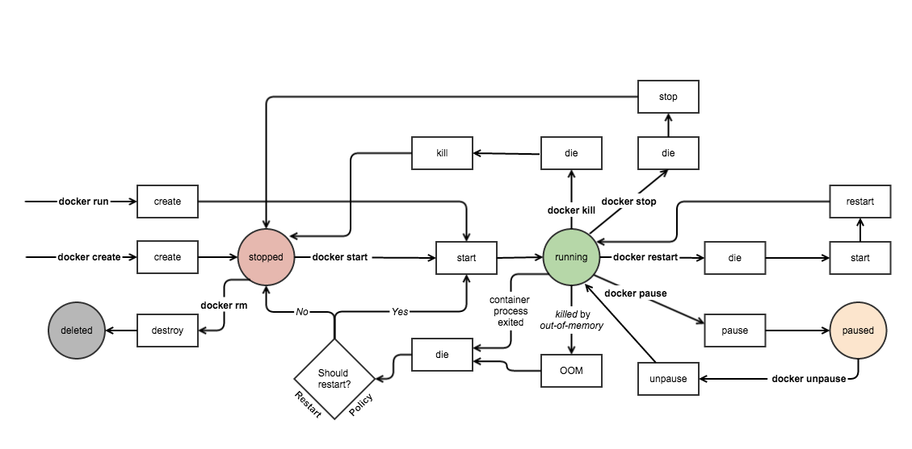

# Docker CLI 操作

### 產生與執行

1. docker run &lt;image name&gt;  \(&lt;command&gt;\)：由image檔產生container並執行指令，有&lt;command&gt; 實則此指令會取代預設指令執行
2. docker create &lt;image name&gt; \(&lt;command&gt;\)：透過image建立容器，回傳container id
3. docker start \(-a\)  &lt;container id&gt;：啟動指定容器，-a回傳執行結果，否則回傳container id，重啟時不可改變建立時的指令，如下圖一。
4. docker exec \(param\) &lt;container id&gt; &lt;command&gt;：以某個**已建立**的container執行指令，param可以為以下三種情況：
   1. -i：代表input，可以將指令輸入至指定的運行中container內執行，即透過Linux程序溝通的STDIN輸入。
   2. -t：給container配置一個虛擬的終端機，簡言之，讓輸出的排版更好看，通常會搭配-i以-it的形式一起使用。
   3. -d：讓container進入背景執行。

### 查詢

1. docker ps：取得所有正在運行中的 container。
2. docker ps --all \(or -a\)：取得所有container。
3. docker logs &lt;container id&gt;：不重複執行，取得container紀錄日誌。

### 刪除

1. docker system prune：刪除所有container \(不論狀態\)。
2. docker stop &lt;container id&gt;：停止container，由程序正常終止\(10秒後未終止呼叫kill\)。
3. docker kill &lt;container id&gt;：強制終止container \(不論狀態\)。

### Container的生命週期

