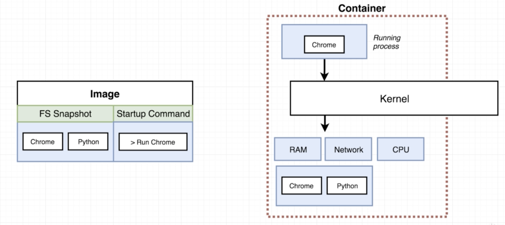
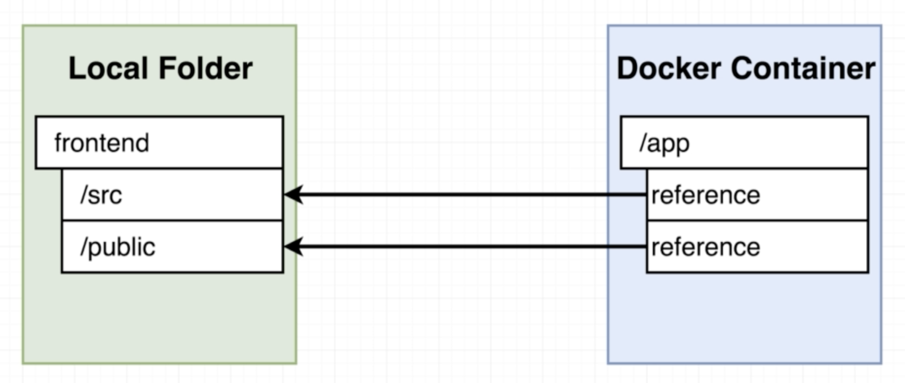
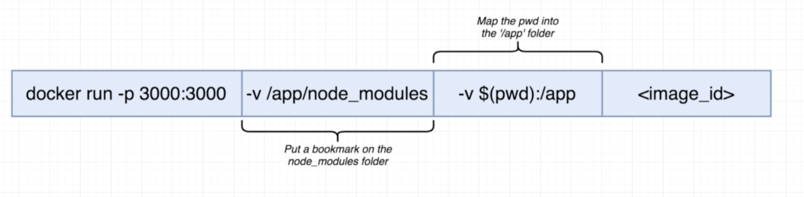

# Docker Volume 基礎

### Container 會遇到的問題

前面提過docker image會將檔案的快照\(snapshot\)保存，並以此建立container來運作；也就是說，container中的**環境並不會跟外界產生連動**，而是在image建立的當下就決定了。

這個情境下會有資料無法轉移的痛點。舉例而言，假設我今天要把建立在docker container中的My SQL DB升級，如果關掉原本的container後再啟動另一個新版本的container，資料就會全部留在舊的container中。

### Docker Volume

上述資料轉移，或者說是容器內部資料的對應，都可以透過Docker Volume得到解決，Docker Volume的運作概念如下圖：

以指定參照的方式取代檔案快照，這麼一來container中操作的資料就會和本地的資料產生連動，container操作的資料也會留在本地端檔案路徑中。

#### Docker Volume的指令如下：

-v指令代表volume

* -v /app/node\_modules  =&gt;  設定書籤，該路徑不做任何參照
* -v $\(pwd\):/app  =&gt;  以：做為參照對應，前代表本地路徑，後代表container內路徑
* $\(pwd\) =&gt; present working directory，這個系統參數會取得目前工作目錄的路徑

