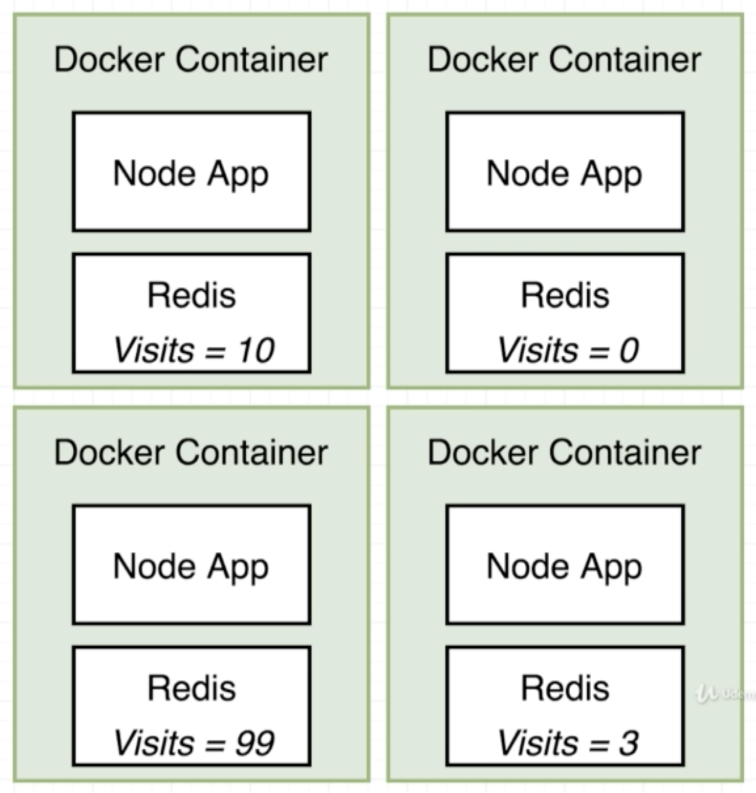
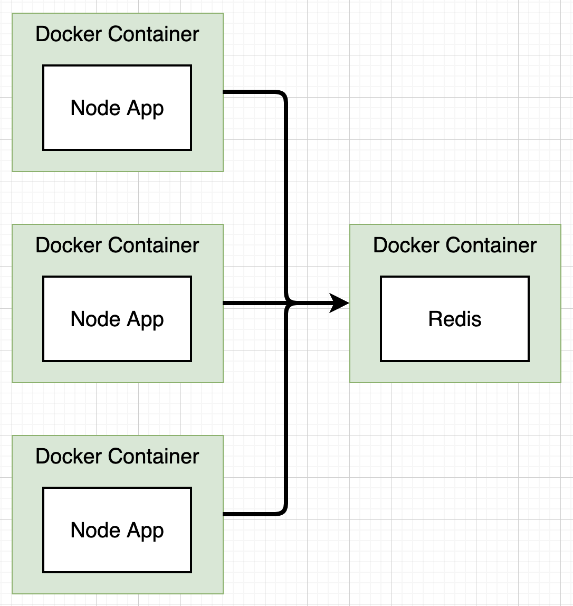
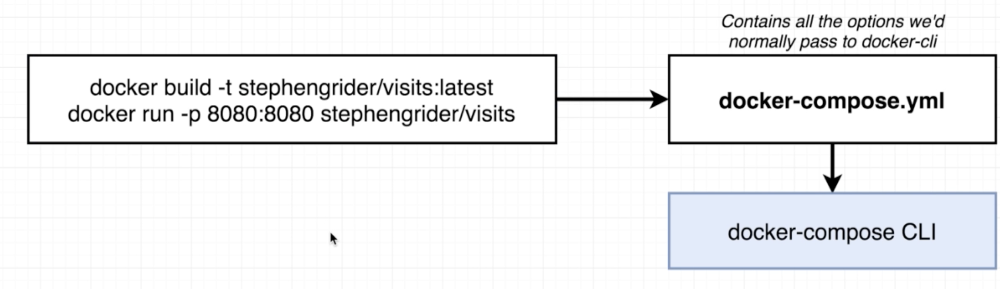
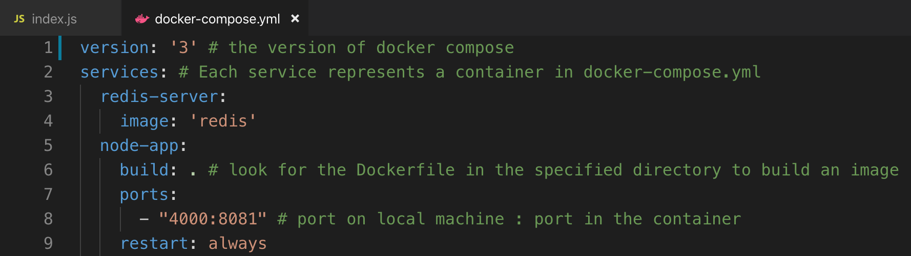
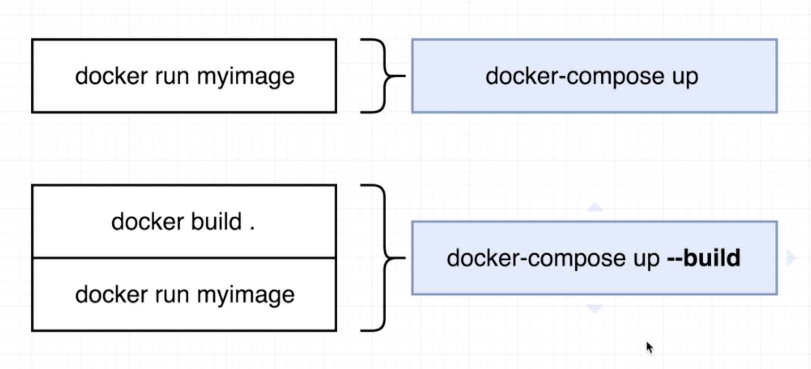
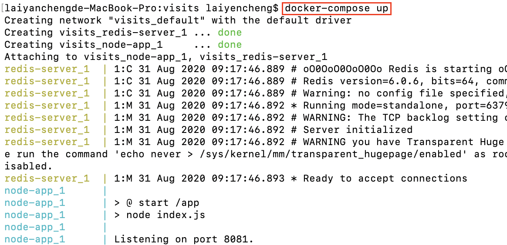
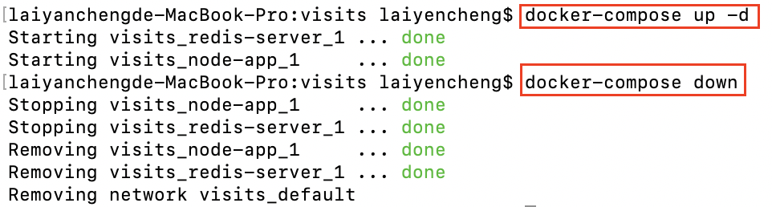
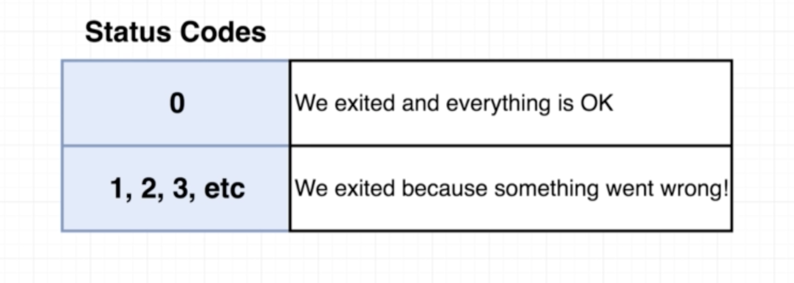

# Docker Compose操作複數容器

### 管控複數容器

在操作docker的時候，假設架構上需要啟多個服務以提高使用者體驗，就會遇到多個container溝通的問題，畢竟，**container之間預設是不能相互溝通的**。舉例來說，假設一個Node的系統要紀錄使用者造訪次數，如果各自在container中建立redis紀錄，就會有下圖的問題：

比較好的架構則則會是下圖的架構，Node系統可以由多個container負責操控，而紀錄造訪次數的Redis則僅架設在一個container中供所有人共用，類似於Design Pattern中Singleton的概念。

### Docker Compose是什麼

要使Container之間彼此能夠溝通，開發人員可以透過對本機溝通來達到這個目的，譬如指定各container對應到本地端的指定port號，但這麼做的代價就是我們要使用複雜的指令才能做到。然而使用Docker Compose可以幫助我們輕鬆做到這件事，究竟什麼是Docker Compose：

1. 是docker中的另一套獨立的CLI，在安裝docker時已一併安裝。
2. 用來同時啟動多個docker container。
3. 自動設定container溝通時需要傳給docker run的複雜參數。

簡言之，Docker Compose的作用就是簡化我們在啟動多個container時要做的設定。

### Docker Compose設定

docker compose設定上其實不複雜，就是透過一個YAML檔案，遵守既定的格式撰寫完畢後，docker-compose的CLI就能夠直接按照上面的設定建立container，概念上如下圖：

實務應用上，開發人員要在專案中建立一個docker-compose.yml檔案：

* version：說明docker compose的版本
* services：每一個service代表一個container，這些container可以彼此溝通
* redis-server、node-app：自訂的container的別名
* image：要用來建立container的docker image
* build：用該路徑下的Dockerfile來建立container
* ports：建立對應port號，語法為「本地端port：container中的port」，效果同docker run -p
* restart：container出錯時的重啟模式

### Docker Compose指令

docker-compose.yml檔案設定完成後，我們就可以透過docker compose CLI的指令按照檔案中的設定建立container：

上圖中docker-compose up指令會使docker解析該路徑底下的docker-compose.yml檔案，並依此建立image，再以image產生container，如果我們有更新code的內容，切記要加上**--build**，docker才會重新建立image而不是在image cache拿既有的image使用，範例如下：

我們也可以透過docker-compose up -d讓整個container在背景執行，docker-composer down則是在要關閉docker，範例如下：

### Container Exit Code

在使用container時，最需要注意的就是container因為錯誤而崩潰的情況，這時候就要查看log中的container status code，粗略可以分為以下兩類：

* 0： Container停止執行但視為正常，通常是人為在程式中停止container運行。
* 其他：Container不正常停止執行，表示有錯誤發生所導致。

