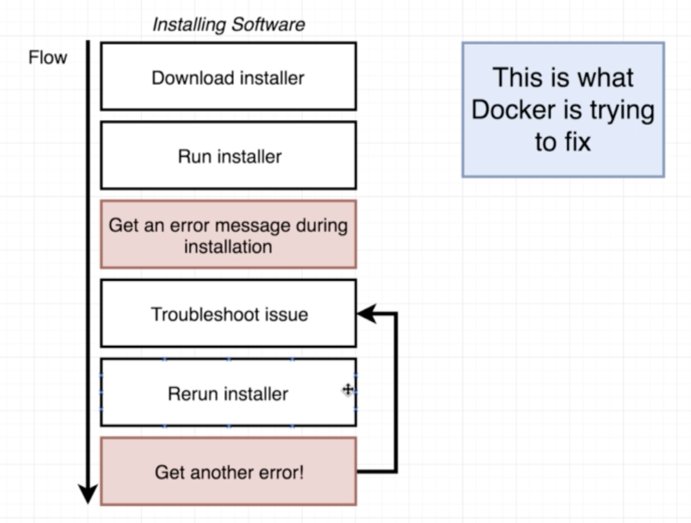

# 什麼是Docker

### 什麼是Docker

Docker是一個可以運行container\(容器\)的平台、生態環境。

### 為什麼要用Docker

Docker是為了要解決我們遭遇到的環境問題，在Docker出現以前，當我們在做環境移植時常會出現下圖的窘境。

使用Docker這項工具可以簡化開發人員的困擾，當需要安裝或移植環境時，可以不必擔心基礎設定或者環境相依性，只要透過Docker image檔案，就可以產生對應的容器\(container\)。

### Docker CLI 和Docker Server

開發人員在終端是透過Docker Client \(CLI\) 操作，而真正執行Docker的核心運作\(建立Docker Image、創造container等等\)的是Docker Server。

