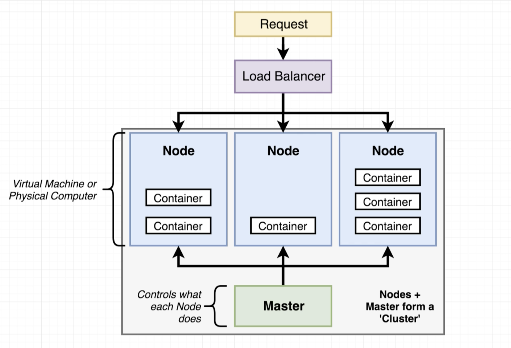
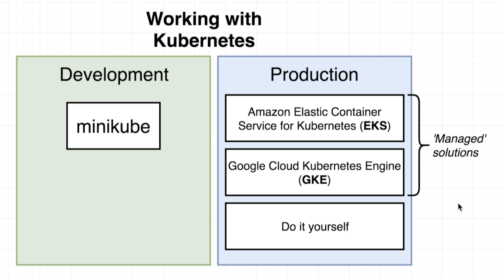
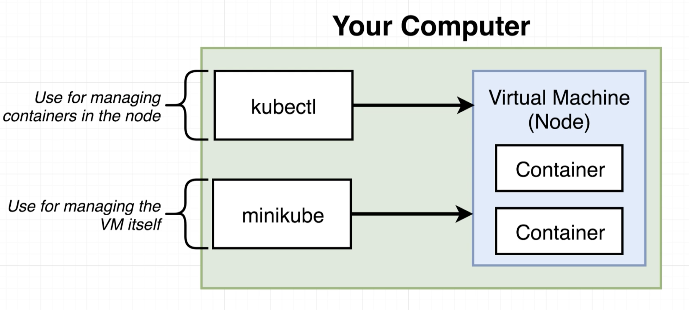

# Kubernetes 基礎

### 什麼是Kubernetes

Kubernetes是一套工具，用以管理在不同主機上運行的不同容器\(container\)，當我們需要運行多個Docker Image來產生多個container時，Kubernetes能夠給我們很大的幫助。

### 使用Kubernetes

使用Kubernetes在開發和正式環境會有很大的差異，開發階段使用的工具會是minikube，而正式階段目前市面上已有很多的解決方案供選擇，像是Amazon的EKS、Google的GKE、Red Hat的OpenShift等等。

### 在本地端使用Kubernetes

本地端使用Kubernetes有兩個主要的工具：

* kubectl：用來管理叢集\(cluster\)中的結點\(Node\)與內部的容器\(Container\)
* minikube：用來建立一個單節點的K8s叢集，只能在本地端使用

